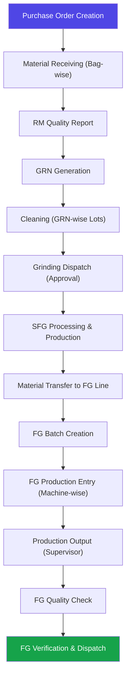

# TGAF-BatchFlow — Complete Project Documentation

> **TGAF-BatchFlow** is a comprehensive, full-stack **Manufacturing Execution & Inventory Management System** built for a food/spice processing factory. It digitizes the entire production lifecycle — from raw material procurement and warehouse management, through cleaning, grinding, and SFG (Semi-Finished Good) processing, all the way to finished goods packaging, quality assurance, and dispatch verification.

---

## Table of Contents

1. [Tech Stack](#tech-stack)
2. [Architecture Overview](#architecture-overview)
3. [Feature Modules](#feature-modules)
   - [Authentication & User Management](#1-authentication--user-management)
   - [Master Data Management](#2-master-data-management)
   - [Purchase Order & Receival Management](#3-purchase-order--receival-management)
   - [Quality Reporting (RM)](#4-raw-material-quality-reporting)
   - [GRN (Goods Received Note) Generation](#5-grn-goods-received-note-generation)
   - [Cleaning & Lot Management](#6-cleaning--lot-management)
   - [Processing & SFG Production](#7-processing--sfg-production)
   - [Grinding Dispatch (Transfer with Approval)](#8-grinding-dispatch-transfer-with-approval)
   - [Bill of Materials (BOM)](#9-bill-of-materials-bom)
   - [Material Transfers](#10-material-transfers)
   - [Production Posting (SFG)](#11-production-posting-sfg)
   - [FG Batch Creation & Management](#12-fg-batch-creation--management)
   - [FG Production Entry (Machine-wise)](#13-fg-production-entry-machine-wise)
   - [FG Production Output Entry](#14-fg-production-output-entry)
   - [FG Quality Check](#15-fg-quality-check)
   - [FG Production Verification & Dispatch](#16-fg-production-verification--dispatch)
   - [Stock & Inventory Management](#17-stock--inventory-management)
   - [Batch (QC Lab) Management](#18-batch-qc-lab-management)
   - [Standards, Parameters & Methodologies](#19-standards-parameters--methodologies)
   - [Transactional Logs & Activity Tracking](#20-transactional-logs--activity-tracking)
   - [Email & Notification System](#21-email--notification-system)
   - [Settings & Application Config](#22-settings--application-config)
4. [Database Schema Summary](#database-schema-summary)
5. [Project Structure](#project-structure)
6. [Deployment & Hosting](#deployment--hosting)

---

## Tech Stack

### Frontend (Client)

| Technology | Purpose | Version |
|---|---|---|
| **React** | Core UI library | 19.x |
| **TypeScript** | Type-safe JavaScript | ~5.7 |
| **Vite** | Build tool & dev server | 6.3 |
| **Tailwind CSS** | Utility-first CSS framework | 4.x |
| **Framer Motion** | Animations & page transitions | 12.x |
| **React Router DOM** | Client-side routing | 7.x |
| **Axios** | HTTP client for API calls | 1.9 |
| **Zustand** | Lightweight state management | 5.x |
| **TanStack React Query** | Server-state caching & sync | 5.x |
| **TanStack React Table** | Headless data table | 8.x |
| **Recharts** | Charting library for dashboards | 2.x |
| **Chart.js + react-chartjs-2** | Additional chart types | 4.x / 5.x |
| **Lucide React** | Icon library | 0.503 |
| **React Hook Form + Zod** | Form management & validation | 7.x / 3.x |
| **Ant Design (antd)** | UI component library (select components) | 5.x |
| **MUI (@mui/material)** | Material Design components | 7.x |
| **FullCalendar** | Calendar views | 6.x |
| **GSAP** | Advanced animations | 3.x |
| **date-fns / moment** | Date utilities | 4.x / 2.x |
| **ExcelJS + file-saver** | Client-side Excel export | 4.x |
| **jsPDF / html2pdf.js** | Client-side PDF generation | 3.x / 0.10 |
| **React Toastify / React Hot Toast** | Toast notifications | 11.x / 2.x |
| **Styled Components** | CSS-in-JS (selective use) | 6.x |

### Backend (Server)

| Technology | Purpose | Version |
|---|---|---|
| **Node.js + Express** | REST API framework | Express 5.1 |
| **TypeScript** | Type-safe backend code | 5.8 |
| **Prisma ORM** | Database access & schema management | 6.6 |
| **PostgreSQL (Neon)** | Cloud-hosted relational database | — |
| **JWT (jsonwebtoken)** | Token-based authentication | 9.x |
| **bcrypt** | Password hashing | 5.x |
| **Nodemailer** | SMTP email sending | 7.x |
| **Brevo SDK (sib-api-v3-sdk)** | Transactional email API | 8.x |
| **Multer** | File upload handling | 1.4 |
| **PDFKit + pdfkit-table** | Server-side PDF generation | 0.17 |
| **Puppeteer / Playwright** | Headless browser for PDF rendering | — |
| **ExcelJS / xlsx** | Server-side Excel export | 4.x / 0.18 |
| **Joi** | Request body validation | 17.x |
| **node-cron** | Scheduled background jobs | 4.x |
| **Husky + lint-staged** | Git hooks for code quality | 9.x / 15.x |
| **nodemon** | Dev auto-restart | 3.x |

### Infrastructure & DevOps

| Component | Technology |
|---|---|
| **Database** | PostgreSQL hosted on **Neon** (serverless) |
| **Client Hosting** | Vercel / Render |
| **Server Hosting** | Render |
| **File Storage** | Cloudinary (PDF catalogues, images) |
| **Email Service** | Brevo (Sendinblue) + SMTP via Nodemailer |
| **Version Control** | Git |

---

## Architecture Overview

```
┌────────────────────────────────┐
│         React Frontend         │
│  (Vite + TypeScript + Tailwind)│
│  Deployed on Vercel / Render   │
└──────────────┬─────────────────┘
               │ HTTPS (REST API)
               ▼
┌────────────────────────────────┐
│     Express.js Backend         │
│   (TypeScript + Prisma ORM)    │
│   Deployed on Render           │
│                                │
│  ┌──────────┐  ┌────────────┐  │
│  │ Auth/JWT  │  │ Cron Jobs  │  │
│  └──────────┘  └────────────┘  │
└──────────────┬─────────────────┘
               │ Prisma Client
               ▼
┌────────────────────────────────┐
│   PostgreSQL (Neon Serverless) │
│   ~60+ Models, 30+ Enums      │
└────────────────────────────────┘
```

- **Monorepo** with `client/` and `server/` directories
- RESTful API design with controller-based architecture
- Role-Based Access Control (RBAC) with granular permissions
- Transactional data integrity using Prisma `$transaction` with extended timeouts (30s for Neon)

---

## Feature Modules

### 1. Authentication & User Management

| Feature | Description |
|---|---|
| **Login / Register** | JWT-based auth with bcrypt password hashing |
| **Role-Based Access Control** | Dynamic roles & permissions system |
| **Permission Management** | Granular page-level & action-level permissions per role |
| **User Management** | Admin panel to create, update, and manage users |
| **Profile** | User self-service profile view |
| **Secure Routes** | Frontend route guards based on role permissions |

**Key Files:** `Login.tsx`, `User-Management.tsx`, `Profile.tsx`, `secureroute.tsx`, `auth.controller.ts`

---

### 2. Master Data Management

The "Masters" module is the foundational data setup that powers the entire system.

| Master | Description |
|---|---|
| **Raw Material Products** | SKU-coded products with categories: `RAW_MATERIAL`, `SEMI_FINISHED_GOOD`, `FINISHED_GOOD`, `PACKAGING_MATERIAL`, `BYPRODUCT`, `WASTAGE`. Fields include variety, unit of measurement, min reorder level, and vendor link. |
| **Vendors** | Supplier directory with vendor code, contact details, banking info, and enable/disable toggle |
| **Locations** | Multi-type facility master: `WAREHOUSE`, `CLEANING`, `GRINDING`, `SFG_WAREHOUSE`, `FG_PACKAGING`, `OTHER`. Used as source/destination in transfers |
| **Warehouses** | Legacy warehouse master for stock storage (being superseded by Locations) |
| **Machine Master** | Packaging line machines with machine ID, name, location, capacity (boxes/shift), and speed |
| **Bill of Materials (BOM)** | Recipe definitions that map SFG products to their raw material inputs (see [BOM section](#9-bill-of-materials-bom)) |
| **FG Packaging Master** | Defines packet size, packet unit, and carton capacity for each finished product |

**Key Files:** `CreateRawMaterial.tsx`, `CreateVendor.tsx`, `CreateLocation.tsx`, `MachineMaster.tsx`, `CreateBOM.tsx`, `CreateFGPackaging.tsx`

---

### 3. Purchase Order & Receival Management

End-to-end procurement workflow from PO creation to item-level receiving.

| Feature | Description |
|---|---|
| **Create Purchase Order** | Multi-item POs with vendor selection, expected dates, and per-item rates |
| **PO Listing & Stats** | Table view with stats bar (Total, Fully Received, Partially Received, Pending) |
| **Item-Level Receiving** | Receive materials per PO item with two weight modes: **Individual Bags** (per-bag weights) or **Total Weight** (optional split into equal bags) |
| **Auto-Status Determination** | Status automatically computed: `PENDING` → `PARTIALLY_RECEIVED` → `RECEIVED` based on `totalReceived vs quantityOrdered` |
| **Receival History** | Full audit trail of every receival with warehouse, weight mode, bags, notes, and timestamp |
| **Warehouse Selection** | Choose destination warehouse at receival time; inline "Add Warehouse" form |
| **Auto-Correction on Fetch** | Background self-healing: mismatched statuses are corrected when PO list is loaded |
| **PO Email** | Send PO details via email to vendors |
| **PO Edit / Delete** | Edit expected date; delete PO only if no receivals exist |
| **Stock Auto-Update** | Receiving automatically creates stock entries and updates `CurrentStock` |

**Key Files:** `PurchaseOrder.tsx`, `statusModal.tsx`, `purchase.controller.ts`

---

### 4. Raw Material Quality Reporting

| Feature | Description |
|---|---|
| **Create Quality Report** | Log quality parameters against received raw materials (per PO item) |
| **Parameter Logging** | Flexible parameter-result-standard triplets per report |
| **Edit / Delete Reports** | Full CRUD on quality reports |
| **Export (Excel)** | Export individual or all reports to Excel |
| **Email Reports** | Mail reports to stakeholders (all or filtered) |
| **Filter & Search** | Multi-criteria filtering for reports |

**Key Files:** `RMQualityReport.tsx`, `quality.controller.ts`, `qualityMail.controller.ts`, `qualityExportFiltered.controller.ts`

---

### 5. GRN (Goods Received Note) Generation

| Feature | Description |
|---|---|
| **Generate GRN from Quality Report** | Link a quality report to a PO to generate a formal GRN |
| **GRN Listing** | View all GRNs with PO cross-reference |
| **GRN by PO** | View GRNs grouped by purchase order |
| **GRN Details** | Includes truck number, delivery location, cost center, bag/pack info, remarks |
| **Delete GRN** | Remove GRN if downstream operations haven't started |

**Key Files:** `GenerateGRN.tsx`, `grn.controller.ts`

---

### 6. Cleaning & Lot Management

GRN-wise cleaning workflow that transforms received raw materials into cleaned, lot-tracked inventory.

| Feature | Description |
|---|---|
| **GRN-wise Cleaning** | Initiate cleaning jobs from GRN-received materials |
| **Cleaning Lot Creation** | Each cleaning job generates a uniquely numbered lot with warehouse assignment |
| **Wastage Tracking** | Track stone wastage and seed wastage per lot (qty + percentage) |
| **Cleaning Completion** | Record cleaned quantity and finish job, updating lot status |
| **Cleaning Job Listing** | View all in-progress and completed cleaning jobs |
| **Cleaned Materials View** | View all cleaned/available lots for downstream processing |

**Key Files:** `allItems.tsx` (cleaning), `cleaningGrn.controller.ts`, `cleaning.controller.ts`

---

### 7. Processing & SFG Production

The processing module converts cleaned lots into Semi-Finished Goods (SFGs) and by-products.

| Feature | Description |
|---|---|
| **Create Processing Batch** | Select cleaned lots, allocate quantities, and start processing |
| **Processing Entry** | Record SFG output, by-products, scrap, and finished goods from a batch |
| **Stock Verification** | Supervisory verification of processed stock before outbound |
| **Outbound Transfers** | Create outbound transfers to move SFG to packaging locations |
| **Inbound Tracking** | View and accept incoming material transfers at grinding/processing |
| **Processing Batch List** | Comprehensive listing with filtering and status tracking |

**Key Files:** `ProcessingBatchesPage.tsx`, `ProductionEntry.tsx`, `StockVerification.tsx`, `OutboundTransfers.tsx`, `IncomingTransfers.tsx`, `processingList.tsx`, `processing.controller.ts`, `production.controller.ts`

---

### 8. Grinding Dispatch (Transfer with Approval)

A specialized transfer workflow with approval gates for grinding operations.

| Feature | Description |
|---|---|
| **Create Dispatch** | Send cleaned lots from a source location to a grinding location with lot-level allocation |
| **Dispatch Listing** | View all dispatches with status (`SENT`, `ACCEPTED`, `REJECTED`) |
| **Accept / Reject** | Receiving location can accept or reject dispatches with reason |
| **Lot Tracking** | Each dispatch line tracks cleaning lot ID and allocated quantity |
| **Consumed Quantity Tracking** | Tracks how much of a dispatch has been consumed in production |

**Key Files:** `DispatchToGrinding.tsx`, `grindingDispatch.controller.ts`

---

### 9. Bill of Materials (BOM)

Recipe management for defining what raw materials go into producing a Semi-Finished Good.

| Feature | Description |
|---|---|
| **Create BOM** | Define a recipe: SFG product, output quantity, and ingredient list with quantities & units |
| **Link to SFG Product** | BOMs are linked to `RawMaterialProduct` entries of category `SEMI_FINISHED_GOOD` |
| **BOM Status Lifecycle** | `DRAFT` → `ACTIVE` → `INACTIVE` |
| **BOM Items** | Each item maps a raw material with required quantity and unit |
| **Edit / Delete BOM** | Full CRUD with cascading item management |
| **BOM Lookup by SFG** | Fetch BOM by SFG product ID for production allocation |

**Key Files:** `CreateBOM.tsx`, `bom.controller.ts`

---

### 10. Material Transfers

Flexible inter-location transfer system supporting multiple material categories.

| Feature | Description |
|---|---|
| **Create Transfer** | Transfer materials between locations (Warehouse → Grinding, SFG → Packaging, etc.) |
| **Transfer Directions** | `INBOUND_TO_GRINDING`, `OUTBOUND_FROM_GRINDING`, `SFG_TO_PRODUCTION` |
| **Line Item Types** | `RAW_MATERIAL`, `SFG`, `BYPRODUCT`, `SCRAP`, `PACKAGING_MATERIAL` |
| **Multi-Material Cart** | Add multiple materials to a single transfer, grouped by location pair |
| **Accept / Reject** | Receiving location confirms or rejects with reason |
| **Transfer Number** | Auto-generated unique transfer numbers |
| **Stock-Aware Selection** | SFG batch selection with available stock validation |

**Key Files:** `CreateMaterialTransferPage.tsx`, `MaterialTransferPage.tsx`, `ReceiveMaterialsPage.tsx`, `transfer.controller.ts`

---

### 11. Production Posting (SFG)

Record and track the actual production of Semi-Finished Goods using BOM recipes.

| Feature | Description |
|---|---|
| **Post Production** | Create a production posting linked to a BOM and SFG product |
| **Consumption Tracking** | Record actual vs expected raw material consumption per item |
| **Output Recording** | Log outputs by type: `SFG`, `BYPRODUCT`, `SCRAP` with batch numbers |
| **Availability Check** | Validate raw material availability before production |
| **Complete Production** | Mark posting as completed, updating downstream stock |
| **Outbound Transfer** | Move completed SFG production to outbound via transfers |

**Key Files:** `SFGProcessingPage.tsx`, `OutboundToSFGPage.tsx`, `production.controller.ts`

---

### 12. FG Batch Creation & Management

Create and manage Finished Good batches that consume SFG materials.

| Feature | Description |
|---|---|
| **Create FG Batch** | Select a BOM, set production quantity, allocate SFG consumption |
| **Batch Listing** | View all FG batches with status filtering |
| **Batch Approval** | Accept/reject workflow before production begins |
| **Batch Consumption** | Track SFG batch numbers and quantities consumed |
| **Status Flow** | `CREATED` → `ACCEPTED` → (production entries) → completed |

**Key Files:** `CreateFGBatchPage.tsx`, `FGProductionPage.tsx`, `fgBatch.controller.ts`

---

### 13. FG Production Entry (Machine-wise)

Detailed machine-level production planning and allocation for packaging lines.

| Feature | Description |
|---|---|
| **Create Production Entry** | Link to an accepted FG batch, assign machines, allocate quantities |
| **Machine Assignment** | Assign one or more packaging machines to the entry |
| **Per-Machine Metrics** | Track per machine: allocated qty, installed capacity, laminate consumption, SFG consumption, man power status |
| **Multi-Machine Support** | Add multiple machines dynamically with individual allocations |
| **Entry Listing** | View all production entries with status tracking |

**Key Files:** `NewFGProductionEntryPage.tsx`, `fgProduction.controller.ts`

---

### 14. FG Production Output Entry

Supervisor-level production recording after actual manufacturing.

| Feature | Description |
|---|---|
| **Machine-wise Output** | Record actual FG produced, by-product, scrap per machine |
| **Laminate Metrics** | Track laminate wastage (KG and %) per machine |
| **Powder Wastage** | Track powder wastage (KG and %) |
| **Shift Tracking** | Record shift (DAY/NOON/NIGHT) and manhour data |
| **Downtime Records** | Log machine downtime with start/stop times and breakdown reasons |
| **Machine Utilization** | Track utilized vs non-utilized machine hours |
| **Boxes Per Shift** | Track boxes achieved per shift |
| **Complete Entry** | Finalize and aggregate totals across all machines |

**Key Files:** `ProductionOutputEntryPage.tsx`, `fgProduction.controller.ts`

---

### 15. FG Quality Check

Post-production quality assessment for finished goods.

| Feature | Description |
|---|---|
| **Submit Quality Report** | Attach quality parameters to a completed production entry |
| **Parameter Logging** | Flexible parameter-standard-result per entry |
| **Linked to FG Batch** | Quality reports reference the parent FG batch |

**Key Files:** `FGQualityCheckPage.tsx`, `fgProduction.controller.ts`

---

### 16. FG Production Verification & Dispatch

Supervisory verification before final dispatch to FG warehouse.

| Feature | Description |
|---|---|
| **Dispatch for Verification** | Send completed production entries for QA/supervisor verification |
| **Verification Listing** | View all pending/completed verifications |
| **Accept / Reject** | Verify or reject with rejection reasons |
| **Verification Number** | Auto-generated unique verification numbers |
| **Metrics Display** | Shows total actual FG quantity, boxes achieved, target vs actual |
| **Destination Location** | Select target FG packaging/warehouse location |

**Key Files:** `FGVerificationPage.tsx`, `OutboundToFGPage.tsx`, `fgVerification.controller.ts`

---

### 17. Stock & Inventory Management

Real-time stock tracking across all warehouses and locations.

| Feature | Description |
|---|---|
| **Current Stock View** | Real-time stock levels per raw material per warehouse |
| **Stock Distribution** | Visual breakdown of stock across warehouses |
| **Stock Entries** | Full IN/OUT entry log with reference IDs for traceability |
| **Stock Timeline** | Chronological view of stock movements for a material |
| **Low Stock Alerts** | Dashboard alerts when stock falls below reorder level |
| **Waste Stock Tracking** | Track and report waste quantities by product |

**Key Files:** `Stock.tsx`, `Timeline.tsx`, `stock.controller.ts`

---

### 18. Batch (QC Lab) Management

Independent quality control lab batch processing with maker-checker workflow.

| Feature | Description |
|---|---|
| **Create Batch** | Lab batch with product, GRN number, lot number, production/expiry dates |
| **Parameter Entry** | Record test values against standard parameters with units & methodologies |
| **Maker-Checker Workflow** | Batch created by maker → submitted → approved/rejected by checker |
| **Draft System** | Save incomplete batches as drafts for later completion |
| **Batch Verification** | Independent verification of parameter values with remarks |
| **Certificate Generation** | Auto-generate quality certificates from approved batches |
| **Export & Email** | Export batch data to Excel; email batch reports |
| **Seed Wastage Tracking** | Cross-referenced wastage records per batch |

**Key Files:** `batch.tsx`, `batchverification.tsx`, `BatchList.tsx` (Review), `Batch.controller.ts`

---

### 19. Standards, Parameters & Methodologies

Master configuration for quality standards used across all QC modules.

| Feature | Description |
|---|---|
| **Standard Categories** | Group standards by category (e.g., Physical, Chemical, Microbiological) |
| **Standard Parameters** | Define test parameters with data types (`TEXT`, `FLOAT`, `INTEGER`, `BOOLEAN`, `PERCENTAGE`, `DATE`), units, and standard values |
| **Standards** | Named standards with code, description, category, and status (`ACTIVE`, `INACTIVE`, `DEPRECATED`) |
| **Standard Definitions** | Map parameters to specific standard values with methodology |
| **Methodologies** | Testing methods with descriptions and procedures |
| **Units of Measurement** | Centralized UOM management with name and symbol |
| **Product-Parameter Linking** | Map specific parameters to products for QC templates |

**Key Files:** `standard.tsx`, `standard.route.ts`

---

### 20. Transactional Logs & Activity Tracking

Comprehensive audit trail across all operations.

| Feature | Description |
|---|---|
| **Transaction Logs** | Every RECEIVE, TRANSFER, PRODUCTION, DISPATCH action is logged with user, entity, and description |
| **Activity Logs** | Batch-specific activity tracking (created, submitted, approved, rejected) |
| **User Attribution** | All logs link back to the acting user |
| **Filterable View** | Frontend log viewer with search and filter capabilities |

**Key Files:** `TransactionalLog.tsx`, `ActivityLog.tsx`, `log.controller.ts`

---

### 21. Email & Notification System

| Feature | Description |
|---|---|
| **PO Email** | Send purchase orders to vendors via email |
| **Quality Report Email** | Email RM quality reports (individual, all, or filtered) |
| **Batch Report Email** | Email batch QC reports |
| **Scheduled Mail Jobs** | Cron-based scheduled email sending |
| **In-App Notifications** | Notification system for batch status changes |

**Key Files:** `sendPurchaseOrderMail.controller.ts`, `qualityMail.controller.ts`, `qualityMailFiltered.controller.ts`

---

### 22. Settings & Application Config

| Feature | Description |
|---|---|
| **Application Settings** | General app configuration |
| **Theme Support** | CSS-variable based theming with dark mode support |

**Key Files:** `Settings.tsx`

---

## Database Schema Summary

The Prisma schema contains **60+ models** and **30+ enums**. Below is a summary of the core domain models (excluding Training & Audit):

### Core Domain Models

| Model Group | Models | Purpose |
|---|---|---|
| **Auth** | `User`, `Role`, `Permission` | Authentication & authorization |
| **Raw Material** | `RawMaterialProduct`, `Vendor`, `FGPackagingMaster` | Material & supplier master |
| **Procurement** | `PurchaseOrder`, `PurchaseOrderItem`, `ReceivalEntry`, `ReceivalBag` | PO & receiving |
| **Quality (RM)** | `RMQualityReport`, `RMQualityParameter` | RM quality check |
| **GRN** | `GRNbyPo` | Goods received note |
| **Cleaning** | `CleaningJob`, `CleaningLog`, `CleaningLot` | Cleaning process & lots |
| **Processing** | `ProcessingJob`, `ProcessingBatchLot`, `FinishedGood`, `ByProduct` | SFG processing |
| **Location** | `Location`, `Warehouse` | Location & warehouse master |
| **Transfers** | `MaterialTransfer`, `MaterialTransferLine` | Inter-location transfers |
| **Grinding** | `GrindingDispatch`, `GrindingDispatchLot` | Grinding dispatch approval |
| **BOM** | `BillOfMaterial`, `BOMItem` | Recipe management |
| **Production** | `ProductionPosting`, `ProductionConsumption`, `ProductionOutput` | SFG production |
| **FG Batch** | `FGBatch`, `FGBatchConsumption` | FG batch lifecycle |
| **FG Production** | `FGProductionEntry`, `FGProductionMachineEntry`, `FGDowntimeRecord` | Machine-level FG production |
| **FG QC** | `FGQualityReport`, `FGQualityParameter` | FG quality check |
| **FG Verification** | `FGProductionVerification` | Dispatch verification |
| **Inventory** | `CurrentStock`, `StockEntry`, `UnfinishedStock`, `ReusableStock` | Stock tracking |
| **QC Lab** | `Batch`, `BatchParameterValue`, `BatchDraft`, `SeedWastageRecord` | Lab batch QC |
| **Standards** | `Standard`, `StandardCategory`, `StandardParameter`, `StandardDefinition`, `Methodology`, `UnitOfMeasurement`, `Product`, `ProductParameter` | QC standard config |
| **Logs** | `TransactionLog`, `ActivityLog`, `ExportLog`, `Notification` | Auditing |
| **Machine** | `Machine` | Machine master |

---

## Project Structure

```
TGAF-BatchFlow/
├── client/                          # React Frontend
│   ├── src/
│   │   ├── App.tsx                  # Main app with routing (~52KB)
│   │   ├── main.tsx                 # Entry point
│   │   ├── index.css                # Global styles & CSS variables
│   │   ├── components/
│   │   │   ├── layout/              # AppLayout, Header, Sidebar, SecureRoute
│   │   │   ├── common/              # Shared components
│   │   │   ├── ui/                  # Reusable UI (Modals, Sidebar, Settings)
│   │   │   ├── material/            # Material-specific components
│   │   │   └── pages/
│   │   │       ├── Auth/            # Login
│   │   │       ├── Home/            # Landing page (Hero, Features, CTA)
│   │   │       ├── Masters/         # Raw Material, Vendor, Location, Machine, BOM, FG Packaging
│   │   │       ├── Order/           # Purchase Orders, Transaction Logs
│   │   │       ├── QualityReport/   # RM Quality Reports
│   │   │       ├── GenerateGRN/     # GRN Generation
│   │   │       ├── cleanning/       # Cleaning Jobs & Lots
│   │   │       ├── processing/      # Processing, SFG Production, Stock Verification
│   │   │       ├── packaging/       # FG Batch, FG Production, Transfers, Verification
│   │   │       ├── Stock/           # Stock Views & Timeline
│   │   │       ├── Batch/           # QC Lab Batches & Verification
│   │   │       ├── Review/          # Batch Review & Listing
│   │   │       ├── standard/        # Standards Management
│   │   │       ├── ActivityLog/     # Activity Log Viewer
│   │   │       ├── User/            # User Management & Profile
│   │   │       └── Settings/        # Application Settings
│   │   ├── context/                 # React contexts
│   │   ├── hooks/                   # Custom React hooks
│   │   ├── store/                   # Zustand stores
│   │   ├── Types/                   # TypeScript type definitions
│   │   ├── utils/                   # Utilities (api.ts with all API routes)
│   │   └── assets/                  # Static assets
│   └── package.json
│
├── server/                          # Express Backend
│   ├── src/
│   │   ├── server.ts                # App entry point, middleware, route mounting
│   │   ├── routes/
│   │   │   ├── auth.route.ts
│   │   │   ├── batch.route.ts
│   │   │   ├── raw.route.ts         # ~13KB — largest route file (all RM/processing/FG routes)
│   │   │   ├── standard.route.ts
│   │   │   ├── dashboard.route.ts
│   │   │   ├── machine.route.ts
│   │   │   ├── product.route.ts
│   │   │   └── draft.route.ts
│   │   ├── controllers/
│   │   │   ├── auth.controller.ts                    # Auth, RBAC, user management
│   │   │   ├── machine.controller.ts                 # Machine CRUD
│   │   │   ├── draft.controller.ts                   # Batch draft management
│   │   │   ├── Batch/                                # QC batch controller
│   │   │   └── rawmaterial/                          # 27 controllers for RM/processing/FG
│   │   │       ├── purchase.controller.ts            # PO & receiving
│   │   │       ├── quality.controller.ts             # RM quality reports
│   │   │       ├── grn.controller.ts                 # GRN generation
│   │   │       ├── cleaningGrn.controller.ts         # GRN-based cleaning
│   │   │       ├── processing.controller.ts          # Processing jobs
│   │   │       ├── production.controller.ts          # SFG production
│   │   │       ├── grindingDispatch.controller.ts    # Grinding dispatch
│   │   │       ├── bom.controller.ts                 # Bill of Materials
│   │   │       ├── transfer.controller.ts            # Material transfers
│   │   │       ├── fgBatch.controller.ts             # FG batch management
│   │   │       ├── fgProduction.controller.ts        # FG production entries
│   │   │       ├── fgVerification.controller.ts      # FG verification
│   │   │       ├── fgPackaging.controller.ts         # FG packaging master
│   │   │       ├── stock.controller.ts               # Stock management
│   │   │       ├── Dashboard.controller.ts           # RM dashboard stats
│   │   │       ├── vendor.controller.ts              # Vendor CRUD
│   │   │       ├── product.controller.ts             # RM product CRUD
│   │   │       ├── location.controller.ts            # Location CRUD
│   │   │       ├── warehouse.controller.ts           # Warehouse CRUD
│   │   │       ├── log.controller.ts                 # Transaction logs
│   │   │       ├── time.controller.ts                # PO timeline
│   │   │       └── sendPurchaseOrderMail.controller.ts
│   │   ├── jobs/                                     # Cron job handlers
│   │   └── generated/prisma/                         # Prisma generated client
│   ├── prisma/
│   │   └── schema.prisma                             # ~1680 lines, 60+ models
│   └── package.json
│
└── api/                              # Additional API utilities
```

---

## Deployment & Hosting

| Component | Platform | URL Pattern |
|---|---|---|
| **Frontend** | Vercel / Render | `tgaf.inventory.nexusinfotech.co` |
| **Backend** | Render | `tgaf-batchflow-1.onrender.com` |
| **Database** | Neon (PostgreSQL) | Serverless, connection pooling |
| **File Storage** | Cloudinary | Image/PDF storage for catalogues |

> [!NOTE]
> The Neon database is serverless PostgreSQL, which requires extended transaction timeouts (30s) for multi-step operations due to cold-start latency. This is configured via Prisma `$transaction({ timeout: 30000, maxWait: 10000 })`.

---

## End-to-End Production Workflow



This represents the complete factory flow from raw material procurement to finished goods dispatch, with quality gates and approval checkpoints at critical stages.
